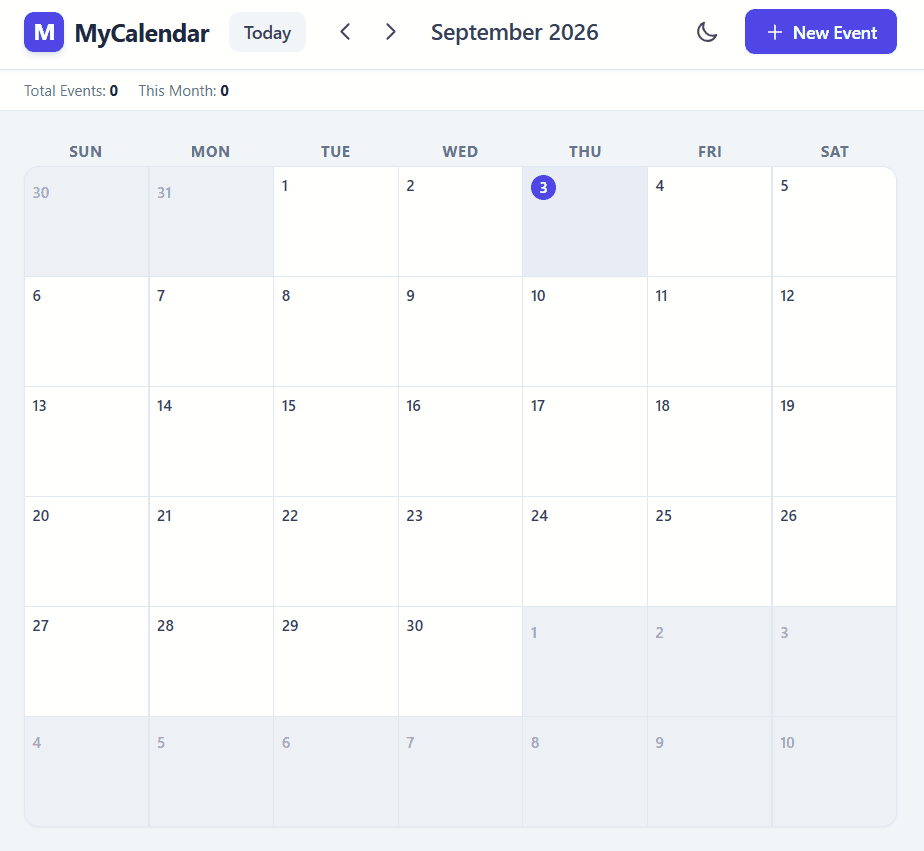

# MyCalendar

A sleek, responsive, and feature-rich Google Calendar-style web application built using HTML5, Tailwind CSS, and pure JavaScript. Manage your daily schedule, categorize events, toggle themes, and filter entries seamlessly—all with zero external library dependencies.

---

## Key Features

- **Monthly Grid View:** Automatically calculates days, dates, and padding days for any selected month.
- **Event Management (CRUD):** Create, view, edit, and delete events easily via interactive modals.
- **Category Color Accent:** Assign visual color codes to categorize events (Work, Personal, Education, Reminders, Urgent).
- **Dark Mode Support:** Seamless theme switching with persistent user preference using Tailwind CSS dark mode classes.
- **Real-time Live Search:** Instantly filter displayed calendar events by title keywords.
- **Analytics Bar:** Quick glance metrics showing total saved events and month-specific event counts.
- **LocalStorage Persistence:** Retains all scheduled events and theme preferences natively in the user's browser.
- **Responsive Design:** Optimized layout for desktop, tablet, and mobile screens.

---

## Built With

- **HTML5:** Semantic markup structure.
- **Tailwind CSS (CDN):** Modern utility-first styling and dark mode management.
- **JavaScript (ES6+):** Pure vanilla DOM manipulation, event handling, and LocalStorage logic.

---

## Demo



---

## Project Structure

MyCalendar/
├── index.html  
├── style.css  
├── script.js  
└── README.md

# Installation

1. Clone the repository

```bash
git clone https://github.com/ahsanstack/My-Calendar.git
```

2. Open the project folder.

3. Open `index.html` in your browser or run it using **Live Server** in Visual Studio Code.

---

## Author

**Ahsan**

- GitHub: https://github.com/ahsanstack

---
